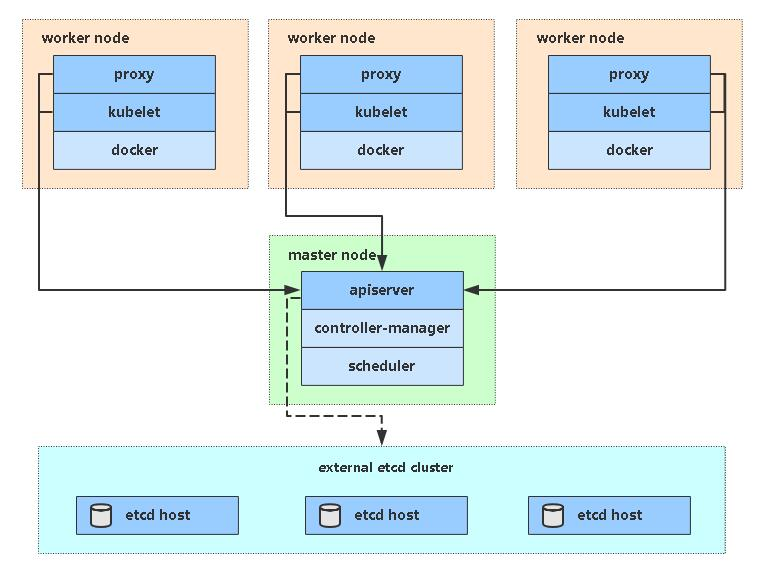
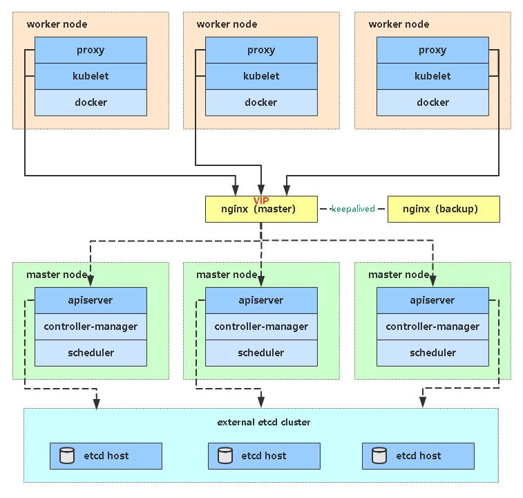

# 说明
魔改自阿良老师的项目 https://github.com/lizhenliang/ansible-install-k8s
- 修改了一些镜像的地址为国内能下载到的源
- 新增了对Debian系列的支持
- 升级k8s版本至1.25.16
- 将离线版安装方式改为在线版，摆脱对百度云的依赖
- 支持k8s安装版本选择功能
- 新增节点时间同步的定时任务
- 还有其他，等待你的发现。。。

# Kubernetes v1.25.16 企业级高可用集群自动部署（在线版）
>### 注：确保所有节点系统时间一致
>### 操作系统要求：CentOS7.x_x64 && > Ubuntu 18.04 LTS

### 1、找一台服务器安装Ansible
```
# yum install epel-release -y
# yum install ansible -y
或
# apt-get install ansible -y
```
### 2、下载所需文件

下载Ansible部署文件：

```
# git clone https://github.com/leif160519/ansible-install-k8s
# cd ansible-install-k8s
```

### 3、修改Ansible文件

修改hosts文件，根据规划修改对应IP和名称。

```
# vim inventory/hosts
...
```
修改group_vars/all.yml文件，修改k8s版本，软件包目录和证书可信任IP。

```
# vim group_vars/all.yml
k8s_version: 1.25.16
...
cert_hosts:
  k8s:
  etcd:
```
## 4、一键部署
### 4.1 架构图
单Master架构


多Master架构

### 4.2 部署命令
单Master版：
```
# ansible-playbook playbooks/single-master-deploy.yml
```
多Master版：
```
# ansible-playbook playbooks/multi-master-deploy.yml
```

## 5、查看集群节点
```
# kubectl get node
NAME            STATUS   ROLES    AGE   VERSION
k8s-master-01   Ready    <none>   54m   v1.25.16
k8s-master-02   Ready    <none>   54m   v1.25.16
k8s-node-01     Ready    <none>   54m   v1.25.16
k8s-node-02     Ready    <none>   54m   v1.25.16
k8s-node-03     Ready    <none>   54m   v1.25.16
```

## 6、其他
### 6.1 部署控制
如果安装某个阶段失败，可针对性测试.

例如：只运行部署插件
```
# ansible-playbook playbooks/single-master-deploy.yml -t addons
```

### 6.2 节点扩容
1）修改hosts，添加新节点ip
```
# vi hosts
...
[newnode]
192.168.31.85 node_name=k8s-node-04
```
2）执行部署
```
# ansible-playbook  playbooks/add-node.yml
```
### 6.3 所有HTTPS证书存放路径
部署产生的证书都会存放到目录“ansible-install-k8s/playbooks/ssl”，一定要保存好，后面还会用到~

### 6.4 若coredns一直起不来问题解决
清排查本地dns配置:
```
cat /etc/resolv.conf
```
若返回的结果有`127.0.0.53`,则需要额外执行一个配置:
```
git clone https://github.com/leif160519/ansible-linux.git
cd ansible-linux.git
ansible-playbook playbooks/config.yml -t network -l pro.k8s
```
执行完成之后，再次检查dns配置，显示如下内容代表正常，此时coredns会自动恢复正常，若不能自动回复，删除pod之后集群会自动生成一个新的pod
```
nameserver 114.114.114.114
nameserver 180.76.76.76
search localdomain
```

## 7、其它组件安装
欢迎clone和star我的项目：[k8s-deploy](https://github.com/leif160519/k8s-deploy)

## 8、其他版本k8s下载地址
- [Download Kubernetes][1]
- [Kubernetes][2]
> 选择`kubernetes-client-linux-amd64.tar.gz`下载即可

## 9、关于etcd的备份和恢复
- [readme][3]

[1]: https://www.downloadkubernetes.com/
[2]: https://github.com/kubernetes/kubernetes/blob/master/CHANGELOG/CHANGELOG-1.25.md#downloads-for-v12516
[3]: ./roles/etcd/readme.md
